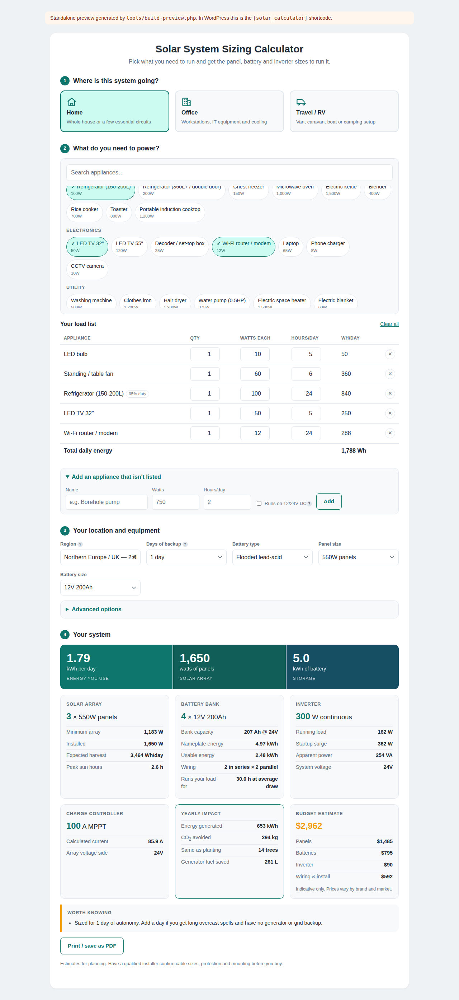

# Solar Power Calculator — WordPress plugin

An off-grid solar sizing calculator for [sustainaportal.com](https://sustainaportal.com).

Visitors pick the appliances they need to run — at home, in an office, or in a van
— and get back the system that will run them: panel wattage, battery bank, inverter,
charge controller, a budget estimate and the CO₂ it avoids.



---

## Installing it on your site

1. Build the installable zip:

   ```bash
   ./tools/build-zip.sh
   ```

   That writes `dist/solar-power-calculator.zip`.

   (If you'd rather not run anything, just zip the `solar-power-calculator/`
   folder yourself — the folder *is* the plugin. Make sure the zip contains the
   folder, not its loose contents.)

2. In WordPress, go to **Plugins → Add New → Upload Plugin**, choose the zip,
   click **Install Now**, then **Activate**.

3. Edit any page or post and add the shortcode:

   ```
   [solar_calculator]
   ```

   In the block editor, add a **Shortcode** block and paste it in. In Elementor,
   use a **Shortcode** widget. In a classic editor, just type it into the content.

4. Publish. That's it — no theme edits, no extra plugins.

Settings live at **Settings → Solar Calculator** (currency, prices, regional
defaults, and the optional email capture).

### Updating later

Re-run the build, then upload the new zip through **Plugins → Add New → Upload
Plugin**. WordPress will offer to replace the existing copy.

---

## Shortcode options

| Attribute  | Default                             | What it does |
|------------|-------------------------------------|--------------|
| `profile`  | `home`                              | Which tab opens first: `home`, `office` or `travel`. |
| `title`    | `Solar System Sizing Calculator`    | Heading above the calculator. Pass `title=""` to hide it. |
| `subtitle` | *(short explainer)*                 | Line under the heading. `subtitle=""` hides it. |
| `costs`    | *(follows the global setting)*      | `yes` or `no` to force the budget card on or off for one page. |
| `theme`    | `auto`                              | `auto`, `light` or `dark`. Auto matches the page's own background. |

Examples:

```
[solar_calculator profile="travel" title="Size your van's solar"]
[solar_calculator costs="no"]
```

You can put more than one on a page — each keeps its own state.

---

## How the sizing works

All of it runs from the appliance's watts, how many you have, and how long each
runs per day.

**Daily energy.** `watts × quantity × hours × duty cycle`. Duty cycle matters for
anything thermostat-controlled: a fridge is plugged in 24 hours but its compressor
only runs about a third of the time, so sizing it at 24 hours of full draw would
roughly triple the system.

**Battery draw.** AC appliances are fed through the inverter, which is ~90%
efficient, so they pull about 11% more out of the battery than they consume. DC
appliances (12V fridges, LED strips, water pumps) skip that penalty entirely —
which is why van builds keep as much as possible on DC.

**System voltage** is chosen from current, not energy: 12V while the connected load
stays under ~1.2kW and the array under 800W, 24V to about 3kW, then 48V. Higher
voltage means less current for the same power, which means thinner cable and
smaller fuses.

**Battery bank** is grossed up for depth of discharge and round-trip efficiency, so
the *usable* capacity — not the nameplate — covers the backup period you asked for.
Lithium gives you 80% of its capacity; lead-acid gives you 50% before cycle life
suffers, so the same job needs roughly a 60% bigger lead-acid bank.

**Solar array** replaces the daily battery draw within the region's peak sun hours,
after controller losses (MPPT 95%, PWM 75%), array losses (85% for heat, dust,
wiring and mismatch) and battery round-trip losses. That works out to roughly 30%
more panel than the naive figure, which is the usual rule of thumb.

**Inverter** is sized on the load likely to run at once (70% by default, adjustable)
with 25% headroom — but never smaller than the single biggest appliance. Surge is
reported separately, since motors draw 2–3× their running watts for a second or two
at startup.

**Charge controller** is the array current at system voltage, plus 25%.

The model lives in two places that must agree, because the page shows one and the
emailed copy is produced by the other:

- `solar-power-calculator/assets/js/solar-calculator.js` — runs in the browser
- `solar-power-calculator/includes/class-spc-calculator.php` — runs on the server

Every constant they use comes from `includes/class-spc-data.php`, so appliances,
regions, battery chemistries and derate factors are edited in exactly one place.

---

## Changing the numbers for your market

Appliance lists, regional sun hours, battery prices and the engineering constants
are all filterable — put this in your theme's `functions.php` or a small
site-specific plugin, and it survives plugin updates:

```php
// Add an appliance.
add_filter( 'spc_appliances', function ( $appliances ) {
	$appliances[] = array(
		'id'       => 'borehole_pump',
		'name'     => 'Borehole pump (1HP)',
		'profiles' => array( 'home' ),
		'group'    => 'Utility',
		'watts'    => 750,
		'hours'    => 2,
		'duty'     => 1,
		'surge'    => 3,
	);
	return $appliances;
} );

// Local battery prices, in whatever currency you set in the admin.
add_filter( 'spc_battery_types', function ( $types ) {
	$types['lithium']['cost_kwh'] = 520;
	return $types;
} );

// Your own peak sun hours.
add_filter( 'spc_regions', function ( $regions ) {
	$regions[] = array( 'id' => 'lagos', 'name' => 'Lagos', 'psh' => 4.3 );
	return $regions;
} );
```

Other filters: `spc_profiles`, `spc_constants`.

There's also a `spc_results_emailed` action that fires with the visitor's email,
name and results — the hook to use if you want to push enquiries into a CRM or
mailing list.

---

## Email capture (optional, off by default)

Turn it on under **Settings → Solar Calculator → Leads**. Visitors can then email
themselves their results, and a copy goes to the address you nominate.

Two things to know before you enable it:

- WordPress's built-in mail is unreliable on most hosts. Install an SMTP plugin
  (WP Mail SMTP, Post SMTP, or similar) or the mail will silently fail.
- You're collecting an email address, so make sure your privacy policy covers it.

Sends are nonce-protected and rate-limited to one per address and one per IP per
minute. The sizing in the email is recalculated on the server rather than trusted
from the browser.

---

## Working on the code

No build step and no dependencies — the plugin ships the CSS and JS it serves.
The tooling below is only for development.

```bash
# Regenerate the standalone preview from the real plugin source
php tools/build-preview.php
# then open preview/index.html in a browser

# Check the browser engine agrees with the PHP engine
node tools/test-parity.js

# Check form contrast inside simulated light and dark themes
node tools/test-theme.js

# Drive the preview in a real browser
npm install playwright --no-save
node tools/test-ui.js
```

### Theming

The calculator measures the background colour of the page it lands on and stamps
`data-theme="light"` or `"dark"` onto its root element. It deliberately ignores
the visitor's `prefers-color-scheme` setting, because most WordPress themes ignore
it too — honouring it made the calculator go dark inside a light theme, leaving the
theme's dark text on dark input boxes. Pin it with `theme="light"` or
`theme="dark"` if the measurement ever guesses wrong.

Form controls state their colour and background together, with raised specificity,
so a theme cannot set one half of the pair and leave text the same colour as its
box. That is what `tools/test-theme.js` guards.

`tools/scenarios.json` holds the sizing test cases — add one whenever you touch the
model. Both test scripts exit non-zero on failure.

The preview is generated from the actual shortcode output against a thin shim of
the WordPress functions it calls, so it can't drift from what the plugin renders.

---

## Layout

```
solar-power-calculator/          the plugin — this folder is what you install
├── solar-power-calculator.php   plugin header, asset loading, bootstrap
├── includes/
│   ├── class-spc-data.php       appliances, regions, batteries, constants
│   ├── class-spc-calculator.php sizing engine (server side)
│   ├── class-spc-shortcode.php  front-end markup
│   ├── class-spc-email.php      optional email delivery
│   └── class-spc-settings.php   admin screen
└── assets/
    ├── css/solar-calculator.css
    └── js/solar-calculator.js   sizing engine (browser) + UI

tools/                           development only, not shipped
preview/                         generated standalone preview
```

---

## Notes

The results are planning estimates. They'll get you to the right size of system and
a realistic budget, but cable sizing, protection, earthing and mounting need a
qualified installer — which is what the disclaimer under the results says too.

Licensed GPL-2.0-or-later, same as WordPress.
